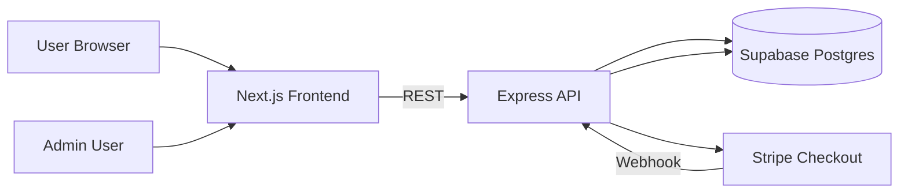

# EZPos-Web Implementation TODO

Purpose: centralized roadmap so implementation can continue phase-by-phase without losing context.

## 1) Current Status Snapshot

- Product scope finalized:
  - Core products: `EZPos Desktop`, `CrossxPos`
  - Optional add-ons managed via admin
- Public pricing fallback implemented in frontend (core plans still visible if API unavailable)
- Add-ons are optional and do not block checkout UI
- Known setup state:
  - Supabase, backend env, frontend env, and deploy pipeline configured
  - Stripe test checkout + webhook smoke test completed successfully
  - Current focus: final production-readiness hardening before full go-live

## 2) Target Architecture

### Architecture Notes

- Frontend is responsible for marketing pages, pricing display, checkout initiation, admin UI.
- Backend is responsible for pricing/add-ons APIs, auth, Stripe checkout/webhook, license generation, sales recording.
- Supabase is the system of record for plans, add-ons, licenses, and sales.
- Stripe is payment gateway and checkout orchestration.

## 3) Phase Roadmap

## Phase 1: Foundation Setup

- [x] Step 1: Create Supabase project
- [x] Step 2: Run schema SQL (`backend/supabase-schema.sql`)
- [x] Step 3: Collect Supabase credentials (URL, service role, anon)
- [x] Step 4: Configure backend `.env` with valid URL/key, admin hash, JWT secret
- [x] Step 5: Start backend and verify health endpoint (`/health`)
- [x] Step 6: Configure frontend `.env.local` to point to backend
- [x] Step 7: Start frontend and validate pricing/admin pages

Definition of done:
- Backend responds `200` on `/health`
- Frontend loads `/pricing` and `/admin/login` without runtime errors

## Phase 2: Commercial and Payment Readiness

- [x] Stripe test keys configured in backend/frontend env
- [x] Stripe webhook local test (`checkout.session.completed`) verified
- [x] License generation verified after successful payment
- [x] Sales row and license row created correctly in DB
- [ ] Admin manual operations validated (pricing update, add-on CRUD)

Definition of done:
- End-to-end test purchase generates visible license and sales record

## Phase 3: Operational Hardening

- [x] Enforce one `Most Popular` plan per core product
- [x] Add webhook idempotency guard
- [ ] Add better error telemetry/logging
- [ ] Add admin audit trail for pricing/add-on changes

Definition of done:
- Repeated webhooks do not duplicate data
- Pricing governance rules enforced reliably

## Phase 4: Product Integration

- [ ] Integrate license verification flow in EZPos-System
- [ ] Integrate license verification flow in CrossxPos
- [ ] Define renewal/expired behavior and UX

Current progress:
- Standardized license validation contract implemented in EZPos-Web API (`valid`, `expired`, `not_found`, `revoked`, `product_mismatch`) with product-aware validation support.

Definition of done:
- Both products can validate and reflect license status consistently

## Phase 5: Deployment and Go-Live

- [x] Deploy frontend (Vercel)
- [x] Deploy backend (Railway/Render)
- [x] Move from test Stripe keys to live keys
- [x] Set production CORS/env values
- [x] Run live smoke tests and rollback checklist

Definition of done:
- Production checkout and license delivery fully operational

## 3.1) Stripe Live Launch TODO (Execute One-by-One)

Goal:
- Move payment flow from Stripe test mode to Stripe live mode safely.

Execution rule:
- Complete each step in order. Do not skip to the next step until current step is verified.

### Step 1 - Pre-flight backend safeguards

- [x] Add webhook idempotency guard (prevent duplicate `checkout.session.completed` processing)
- [x] Ensure webhook failure logs include Stripe event id and error reason
- [x] Confirm `/api/webhook` still returns 2xx for successfully processed events

Done when:
- Duplicate deliveries of the same event do not create duplicate `sales` or `licenses` rows.

### Step 2 - Stripe live account readiness

- [x] Switch Stripe Dashboard to Live mode
- [x] Complete business profile and payout setup
- [x] Enable required payment methods for production (Card first; FPX deferred pending Stripe live eligibility)

Done when:
- Live API keys are visible and account is allowed to accept live payments.

Decision note:
- Launch payment with Stripe Card first.
- FPX in Stripe Live is deferred until account eligibility/verification enables FPX.
- Alternative FPX gateway exploration (for example ToyyibPay) is postponed until core live checkout is stable.

### Step 3 - Create live webhook endpoint

- [x] Create endpoint: `https://ezpos-landing.onrender.com/api/webhook`
- [x] Scope: `Your account`
- [x] Subscribe to event: `checkout.session.completed`
- [x] Copy live webhook signing secret (`whsec_...`)

Done when:
- Stripe webhook endpoint is active in Live mode and shows no configuration error.

### Step 4 - Render production environment update

- [x] Update `STRIPE_SECRET_KEY` to live key (`sk_live_...`)
- [x] Update `STRIPE_WEBHOOK_SECRET` to live signing secret (`whsec_...`)
- [x] Confirm `FRONTEND_URL` is exact production origin (no trailing slash mismatch)
- [x] Redeploy backend service

Done when:
- Backend redeploy succeeds and `/health` responds `ok`.

### Step 5 - Vercel production environment check

- [x] Confirm `NEXT_PUBLIC_API_URL` points to Render backend production URL
- [x] Redeploy frontend
- [x] Confirm pricing page loads from production API

Done when:
- Frontend can open checkout from production environment without CORS errors.

### Step 6 - Controlled live payment smoke test

- [x] Create temporary low-price live plan (for first real transaction)
- [x] Complete one real payment in live mode
- [x] Verify Stripe event delivery status is `Delivered (2xx)`
- [x] Verify 1 new row in `sales`
- [x] Verify 1 new row in `licenses`
- [x] Verify success page shows generated license key

Done when:
- End-to-end production payment and license issuance flow is proven.

### Step 7 - Post-verification cleanup

- [ ] Disable/remove temporary low-price test plan
- [ ] Rotate previously exposed secrets (Supabase service role, Stripe secret, webhook secret, JWT)
- [ ] Update secrets in Render after rotation
- [x] Run one final regression check (admin login, pricing load, checkout open)

Operator note:
- Secret rotation is currently deferred by operator decision for this cycle.
- Temporary low-price plan cleanup remains a required manual production action.

Done when:
- Production is clean, secure, and stable for normal customer traffic.

## 4) Resume-Work Quick Start

When resuming work in a new session:

1. Open this file and check the first unchecked item in current phase.
2. Confirm env/state for backend and frontend.
3. Execute only the next unchecked step.
4. Mark step done and add short note in `Progress Log`.

## 4.1) Deferred Plan: Product Key Validation (After Live Stripe Setup)

Execution rule:
- Run this section only after Stripe live keys and live webhook are fully configured and verified in production.

Validation contract (shared by both products):
- Endpoint response states: `valid`, `expired`, `not_found`, `revoked`, `product_mismatch`
- Enforce product binding: EZPos Desktop keys are rejected by CrossxPos, and vice versa
- Do not expose service-role secrets in client apps; validation must go through backend API

Test matrix (execute for EZPos Desktop and CrossxPos):
- Valid key for correct product
- Valid key for wrong product
- Expired key
- Revoked key
- Unknown key
- Malformed key format
- Network timeout/offline fallback behavior

Per-product integration checks:
- EZPos Desktop: validate on startup, manual re-check, temporary cache behavior
- CrossxPos: validate in onboarding/login path and periodic revalidation behavior
- User messaging: show actionable reason for rejection and recovery path

Operational safeguards:
- Add rate limiting on validation endpoint
- Add audit logs for validation attempts and outcomes
- Define renewal/extension handling and expected state transition

## 4.2) Deferred Plan: Alternative FPX Gateway (Post Go-Live)

Execution rule:
- Start only after Stripe live card checkout is stable in production.

Scope:
- Evaluate separate FPX gateway integration path (for example ToyyibPay) as a second payment rail.
- Keep Stripe and non-Stripe flows isolated, with a shared payment-finalization service for license issuance.

Safety constraints:
- Webhook/callback idempotency must prevent duplicate `sales` and `licenses` rows across gateways.
- Each provider callback must be signature-verified before finalization.
- Unified audit logging required for gateway source, transaction id, and finalization outcome.

## 5) Progress Log

- 2026-05-29:
  - Core/add-on architecture finalized
  - Pricing fallback implemented
  - Add-on optional behavior stabilized
  - Supabase steps 1-3 completed
- 2026-06-01:
  - Backend deployed on Render and frontend deployed on Vercel
  - CORS production origin fixed and validated
  - Stripe test webhook wired with `checkout.session.completed`
  - End-to-end smoke test successful (checkout -> webhook -> license generated)
  - Product key validation plan captured and deferred until Stripe live setup is completed
  - Stripe Step 1 code hardening started: webhook idempotency guard and event-id error logging added
  - Stripe launch decision locked: card-first production launch, FPX deferred pending live eligibility
  - Stripe Live activated with card-first fallback and live checkout test completed successfully
  - Stripe Live TODO Step 1 to Step 6 verified complete (webhook 2xx, payment success, sales/license rows confirmed)
  - Final regression check executed and passed (admin login page, pricing page, checkout flow reachability)
  - Fixed admin pricing rule to enforce only one `Most Popular` plan per product (backend enforcement added)
  - Phase 4 foundation started: license validation API contract standardized for multi-product clients

## 6) Risks and Mitigation

- Risk: Secrets leaked in tracked files/chat
  - Mitigation: rotate Supabase keys immediately and keep secrets only in `.env`
- Risk: Next.js cache/chunk mismatch in dev
  - Mitigation: clear `.next` and restart dev server cleanly
- Risk: Missing env causes backend boot failures
  - Mitigation: verify `.env` against `.env.example` before starting server
