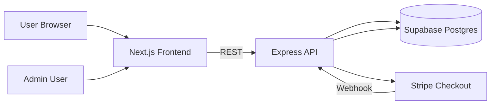

# EZPos-Web Implementation TODO

Purpose: centralized roadmap so implementation can continue phase-by-phase without losing context.

## 1) Current Status Snapshot

- Product scope finalized:
  - Core products: `EZPos Desktop`, `CrossxPos`
  - Optional add-ons managed via admin
- Public pricing fallback implemented in frontend (core plans still visible if API unavailable)
- Add-ons are optional and do not block checkout UI
- Known setup state:
  - Supabase setup progress: `Phase 1` completed until `Step 3`
  - Current focus: `Phase 1, Step 4` (backend `.env` completion + API health check)

## 2) Target Architecture

### Architecture Notes

- Frontend is responsible for marketing pages, pricing display, checkout initiation, admin UI.
- Backend is responsible for pricing/add-ons APIs, auth, Stripe checkout/webhook, license generation, sales recording.
- Supabase is the system of record for plans, add-ons, licenses, and sales.
- Stripe is payment gateway and checkout orchestration.

## 3) Phase Roadmap

## Phase 1: Foundation Setup

- [x] Step 1: Create Supabase project
- [x] Step 2: Run schema SQL (`backend/supabase-schema.sql`)
- [x] Step 3: Collect Supabase credentials (URL, service role, anon)
- [ ] Step 4: Configure backend `.env` with valid URL/key, admin hash, JWT secret
- [ ] Step 5: Start backend and verify health endpoint (`/health`)
- [ ] Step 6: Configure frontend `.env.local` to point to backend
- [ ] Step 7: Start frontend and validate pricing/admin pages

Definition of done:
- Backend responds `200` on `/health`
- Frontend loads `/pricing` and `/admin/login` without runtime errors

## Phase 2: Commercial and Payment Readiness

- [ ] Stripe test keys configured in backend/frontend env
- [ ] Stripe webhook local test (`checkout.session.completed`) verified
- [ ] License generation verified after successful payment
- [ ] Sales row and license row created correctly in DB
- [ ] Admin manual operations validated (pricing update, add-on CRUD)

Definition of done:
- End-to-end test purchase generates visible license and sales record

## Phase 3: Operational Hardening

- [ ] Enforce one `Most Popular` plan per core product
- [ ] Add webhook idempotency guard
- [ ] Add better error telemetry/logging
- [ ] Add admin audit trail for pricing/add-on changes

Definition of done:
- Repeated webhooks do not duplicate data
- Pricing governance rules enforced reliably

## Phase 4: Product Integration

- [ ] Integrate license verification flow in EZPos-System
- [ ] Integrate license verification flow in CrossxPos
- [ ] Define renewal/expired behavior and UX

Definition of done:
- Both products can validate and reflect license status consistently

## Phase 5: Deployment and Go-Live

- [ ] Deploy frontend (Vercel)
- [ ] Deploy backend (Railway/Render)
- [ ] Move from test Stripe keys to live keys
- [ ] Set production CORS/env values
- [ ] Run live smoke tests and rollback checklist

Definition of done:
- Production checkout and license delivery fully operational

## 4) Resume-Work Quick Start

When resuming work in a new session:

1. Open this file and check the first unchecked item in current phase.
2. Confirm env/state for backend and frontend.
3. Execute only the next unchecked step.
4. Mark step done and add short note in `Progress Log`.

## 5) Progress Log

- 2026-05-29:
  - Core/add-on architecture finalized
  - Pricing fallback implemented
  - Add-on optional behavior stabilized
  - Supabase steps 1-3 completed

## 6) Risks and Mitigation

- Risk: Secrets leaked in tracked files/chat
  - Mitigation: rotate Supabase keys immediately and keep secrets only in `.env`
- Risk: Next.js cache/chunk mismatch in dev
  - Mitigation: clear `.next` and restart dev server cleanly
- Risk: Missing env causes backend boot failures
  - Mitigation: verify `.env` against `.env.example` before starting server
